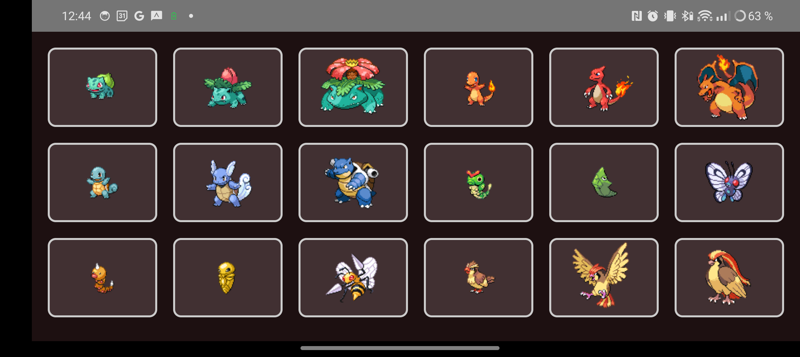

# PokeApi APP

PokeApi APP es una aplicación que permite a los usuarios explorar una lista completa de todos los Pokémon existentes utilizando la API de Pokémon.

## Características

- **Lista de Pokémon:** Visualiza todos los Pokémon disponibles en una lista.
- **Adaptabilidad:** La interfaz se ajusta automáticamente según el tamaño de la pantalla.
- **Retrofit:** Utilizamos la librería Retrofit para realizar las solicitudes a la API de Pokémon.

## Capturas de Pantalla

### Vista de Lista

### Vista de Cuadrícula

## Autores
- [Sergi Saravia](https://github.com/AquaTurquesa)
- [Adrià Sánchez](https://github.com/Ninjakito)

## Créditos
- **API:** [PokeApi](https://pokeapi.co) por proporcionar la API de Pokémon.